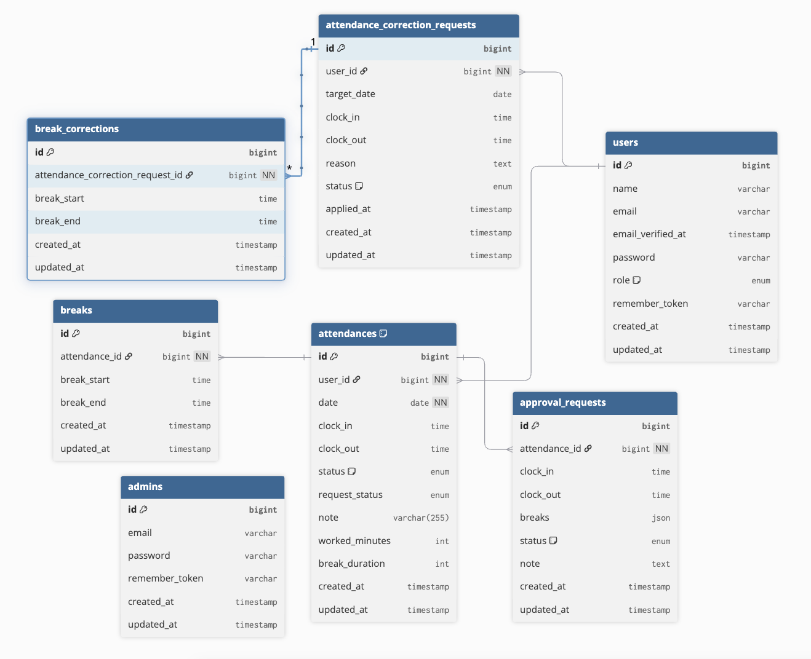

# test6

## 概要
このプロジェクトは勤怠アプリ作成を目的としたものです。

## 環境構築
・Dockerビルド
1.git clone git@github.com:qurow403/test6-.git
2.docker-compose up -d

・Laravel環境構築
1.docker-compose exec php bash
3.composer install
4.データベースに接続するために.envファイルを作成
  .envファイルは、.env.exampleファイルをコピーして作成
  cp .env.example .env
  作成後、環境変数を設定
5.php artisan key:generate
6.php artisan migrate
7.php artisan db:seed

・使用技術
PHP 8.4.3
Laravel 8.83.29
MySQL 15.1

## ER図

[→ dbdiagram.io で開く（編集・拡大表示・編集可）](https://dbdiagram.io/d/683bdd30bd74709cb77f7db5)

・開発用URL
開発環境：http://localhost/
phpMyAdmin:http://localhost:8080/#
